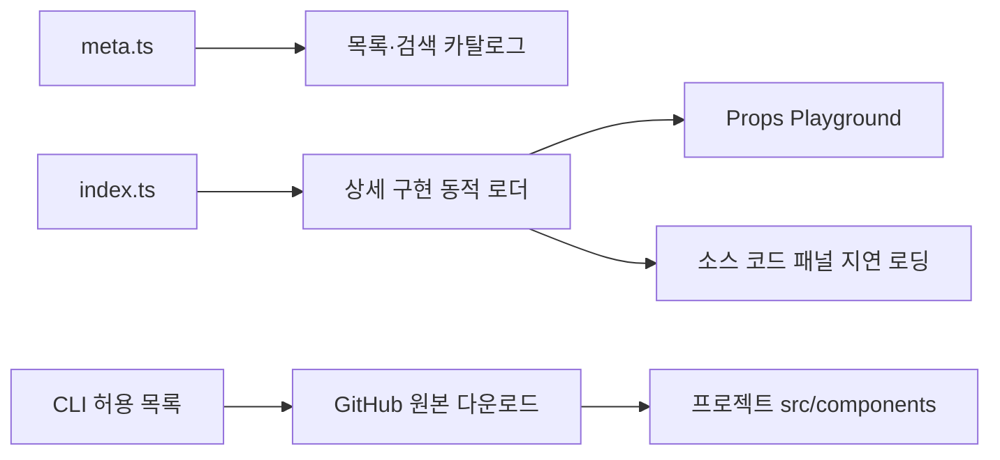

# Uikki✦Uikki

> React 컴포넌트를 미리 보고, Props를 실험하고, 필요한 소스를 내 프로젝트로 가져오는 UI Playground & CLI

[](https://github.com/dmswl6310/Uikki-uikki/actions/workflows/ci.yml)
[](https://www.npmjs.com/package/uikki)
[](./LICENSE)

**[Playground](https://uikki.vercel.app/)** · **[컴포넌트](https://uikki.vercel.app/components)** · **[사용 가이드](https://uikki.vercel.app/guide)** · **[npm](https://www.npmjs.com/package/uikki)**

Uikki는 React·TypeScript·Tailwind CSS로 만든 컴포넌트 갤러리입니다. 브라우저에서 Props, 테마, 화면 폭을 바꾸며 UI를 확인하고, 코드 예시를 복사하거나 CLI로 구현 소스를 가져올 수 있습니다. 가져온 파일은 프로젝트 안에서 직접 수정해 사용합니다.

## 빠른 시작

React와 Tailwind CSS v4가 설정된 프로젝트 루트에서 실행하세요. CLI는 Node.js 18 이상과 GitHub 원본을 다운로드할 수 있는 인터넷 연결이 필요합니다.

```bash
# 지원하는 컴포넌트 확인
npx -y uikki@latest list

# Button 소스 추가
npx -y uikki@latest add button
```

`src/components/ui/Button.tsx`가 생성됩니다. `src/App.tsx`에서 다음처럼 가져와 사용할 수 있습니다.

```tsx
import { Button } from "./components/ui/Button";

export default function App() {
  return <Button label="시작하기" onClick={() => console.log("클릭")} />;
}
```

import 경로는 사용하는 파일 위치에 맞게 조정하세요. Tailwind가 생성된 파일의 클래스를 스캔하도록 설정되어 있어야 합니다. CLI는 React나 Tailwind를 설치하거나 프로젝트 설정을 변경하지 않습니다.

## 주요 기능

- **Props Playground** — 문자열, 숫자, 불리언, 선택, 라디오, 색상, 텍스트 영역 컨트롤로 컴포넌트의 Props를 실시간으로 조작합니다.
- **23개 컴포넌트 탐색** — UI 19개, Block 2개, Template 2개를 카테고리와 검색으로 찾고 예제와 사용법을 확인합니다.
- **테마·화면 폭 미리보기** — 라이트·다크 모드와 390px, 768px, 전체 폭으로 화면을 확인합니다.
- **코드 확인과 복사** — React TypeScript·JavaScript 예시와 렌더링된 HTML을 제공합니다. HTML은 정적 마크업이며 React 이벤트와 상태 동작은 포함하지 않습니다.
- **소스 설치 CLI** — 필요한 구현 파일과 의존하는 Uikki 컴포넌트 소스를 함께 가져오고, 내부 import 경로를 변환합니다.
- **검색과 접근성 지원** — 전역 검색 모달, 키보드 탐색, 포커스 표시, ARIA 상태 속성, `prefers-reduced-motion` 대응을 포함합니다.
- **PWA 지원** — `vite-plugin-pwa`를 사용해 웹 앱 매니페스트와 서비스 워커를 구성합니다.

## CLI 사용법

### 컴포넌트 추가

UI 컴포넌트는 `ui/`를 생략할 수 있습니다. Block과 Template은 카테고리를 함께 입력하세요.

```bash
npx -y uikki@latest add ui/drawer
npx -y uikki@latest add blocks/data-table
npx -y uikki@latest add templates/admin-dashboard
```

출력 경로는 현재 작업 폴더를 기준으로 `src/components/<category>/<PascalCaseName>.tsx`입니다.

```text
src/components/
├─ ui/
│  ├─ Button.tsx
│  └─ DropdownMenu.tsx
├─ blocks/
│  └─ DataTable.tsx
└─ templates/
   └─ AdminDashboard.tsx
```

예를 들어 `blocks/data-table`을 추가하면 `ui/dropdown-menu`도 설치합니다. 여기서 자동 설치는 **의존하는 Uikki 소스 파일을 추가하는 것**이며, npm 패키지를 설치하는 기능은 아닙니다.

### 기존 파일 처리

- 직접 요청한 컴포넌트 파일이 이미 있으면 오류로 종료합니다.
- 의존 컴포넌트 파일이 이미 있으면 해당 파일을 건너뛰고 기존 내용을 유지합니다.
- `--force`를 사용하면 요청한 컴포넌트와 함께 설치되는 의존 파일도 덮어씁니다.

```bash
# 기존 파일을 교체할 때 사용
npx -y uikki@latest add drawer --force
```

의존 파일부터 순서대로 저장하므로, 다운로드 실패나 기존 파일 충돌로 중단되면 일부 파일이 이미 생성되어 있을 수 있습니다. 설치 전체를 되돌리는 기능은 제공하지 않습니다.

### 도움말과 버전

```bash
npx -y uikki@latest --help
npx -y uikki@latest --version
```

자세한 CLI 설명은 [CLI README](./cli/README.md)를 참고하세요.

## 컴포넌트 목록

| 분류 | 항목 |
| --- | --- |
| UI | `accordion`, `avatar`, `badge`, `button`, `card`, `checkbox`, `drawer`, `dropdown-menu`, `input`, `list`, `modal`, `progress`, `radio-group`, `select`, `skeleton`, `tabs`, `toast`, `toggle`, `tooltip` |
| Blocks | `data-table`, `newsletter-cta` |
| Templates | `admin-dashboard`, `checkout-page` |

## 설계와 구조

### 메타데이터로 구성하는 Playground

`ComponentInfo<T>`는 컴포넌트 구현, 예제 Props, 코드 예시, `propControls`를 함께 정의합니다. `propControls`의 키는 `keyof T`를 기반으로 선언하며, 공통 렌더러가 컨트롤 종류에 맞는 입력 UI를 생성합니다. 컴포넌트마다 별도의 Props 편집 화면을 작성하지 않고 같은 구조로 Playground를 확장할 수 있습니다.

### 목록과 상세 구현의 로딩 분리

목록과 검색은 `meta.ts`의 경량 메타데이터를 사용합니다. 선택한 컴포넌트의 상세 구현은 동적으로 가져오고, 소스 코드 패널도 별도로 지연 로딩합니다.



`import.meta.glob`으로 정해진 디렉터리의 메타데이터와 상세 모듈을 등록합니다. 갤러리 등록과 CLI 허용 목록은 별도로 관리합니다.

### 소스를 프로젝트 안에서 관리

컴포넌트는 React 상태, 네이티브 HTML 요소, TypeScript, Tailwind CSS로 구현하며 shadcn/ui나 Radix를 래핑하지 않습니다. CLI는 허용 목록과 출력 경로를 검증하고, 다운로드 제한 시간과 리다이렉트 횟수 제한을 적용합니다.

CLI가 가져오는 소스는 GitHub의 `main` 브랜치 기준입니다. CLI 버전을 고정해도 다운로드되는 컴포넌트 소스까지 특정 커밋에 고정되지는 않습니다. 내려받은 파일의 변경 이력은 사용하는 프로젝트의 Git으로 관리할 수 있습니다.

## 기술 스택

| 영역 | 사용 기술 |
| --- | --- |
| UI | React 19, TypeScript, Tailwind CSS v4 |
| 라우팅 | React Router |
| 개발·빌드 | Vite, 컴포넌트 스캐폴딩 스크립트 |
| PWA | vite-plugin-pwa |
| CLI | Node.js 기본 모듈, npm 배포 |
| 테스트 | Vitest, Testing Library, Node.js 테스트 러너 |
| 품질 검사 | ESLint, TypeScript, GitHub Actions |

## 로컬 개발

갤러리 개발에는 Node.js 20 이상이 필요합니다.

```bash
git clone https://github.com/dmswl6310/Uikki-uikki.git
cd Uikki-uikki
npm ci
npm run dev
```

개발 서버 주소는 터미널에 출력됩니다.

| 명령 | 설명 |
| --- | --- |
| `npm run dev` | 개발 서버 실행 |
| `npm run lint` | ESLint 검사 |
| `npm run typecheck` | TypeScript 타입 검사 |
| `npm run test` | 웹과 CLI 테스트 실행 |
| `npm run build` | 타입 검사 후 프로덕션 빌드 |
| `npm run preview` | 빌드 결과 로컬 확인 |
| `npm run check` | lint → typecheck → test → build 순서로 전체 검사 |

GitHub Actions에서도 lint, 타입 검사, 테스트, 빌드를 실행합니다. 루트 패키지는 갤러리 개발용이며 npm CLI 패키지는 `cli/`에서 관리합니다.

### 새 컴포넌트 추가

```bash
npm run generate -- ui/my-component
```

생성된 디렉터리의 구현 파일, `meta.ts`, `examples.tsx`, `index.ts`를 완성하고 예제 Props와 `propControls`를 정의하세요. CLI에서도 제공하려면 `cli/index.js`의 `REGISTRY`와 의존 컴포넌트 목록을 함께 갱신해야 합니다.

## 프로젝트 구성

```text
src/
├─ components/              # Playground, 코드 패널, 검색, 공통 UI
├─ data/
│  ├─ componentsCatalog.ts  # 목록·검색용 메타데이터 등록
│  ├─ componentLoaders.ts   # 상세 구현 동적 로딩
│  └─ components/
│     ├─ ui/                # 독립 UI 컴포넌트
│     ├─ blocks/            # UI를 조합한 섹션
│     └─ templates/         # 페이지 단위 예제
├─ pages/                   # Home, Components, Guide, NotFound
├─ hooks/                   # SEO 등 공통 훅
└─ types/                   # 컴포넌트와 Props 컨트롤 타입
cli/                        # npm 패키지 uikki
scripts/                    # 컴포넌트 스캐폴딩
.github/workflows/          # CI 품질 검사
```

## 기여와 라이선스

버그 수정, 접근성 개선, 새 컴포넌트 제안을 환영합니다. 개발 및 PR 안내는 [CONTRIBUTING.md](./CONTRIBUTING.md)를 참고하세요.

이 프로젝트는 [MIT License](./LICENSE)로 배포됩니다.
