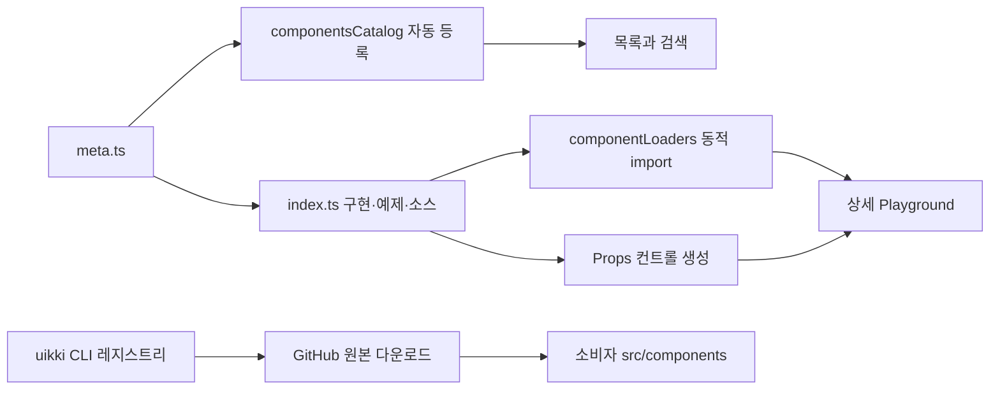

# Uikki✦Uikki

> Props를 직접 바꾸며 확인하고, 필요한 React 컴포넌트 소스를 프로젝트로 가져갈 수 있는 UI Playground & CLI

[](https://github.com/dmswl6310/Uikki-uikki/actions/workflows/ci.yml)
[](https://www.npmjs.com/package/uikki)
[](./LICENSE)

**[Playground](https://uikki.vercel.app/)** · **[컴포넌트 보기](https://uikki.vercel.app/components)** · **[사용 가이드](https://uikki.vercel.app/guide)** · **[npm CLI](https://www.npmjs.com/package/uikki)**

Uikki는 자주 쓰는 UI를 브라우저에서 탐색하고, 메타데이터로 생성된 컨트롤을 통해 Props를 실시간으로 실험하는 React 기반 갤러리입니다. 선택한 컴포넌트는 TypeScript·JavaScript·HTML 형태로 확인할 수 있으며, `uikki` CLI로 원본 소스를 애플리케이션 안에 내려받아 직접 수정할 수 있습니다.

## 해결하려던 문제

UI 패키지는 빠르게 시작하기 좋지만 세밀한 수정이 필요해지면 추상화 내부를 이해해야 하고, 단순 복사 방식은 실제 동작과 Props 조합을 미리 확인하기 어렵습니다. Uikki는 다음 흐름을 하나로 연결합니다.

1. 검색과 카테고리 필터로 컴포넌트를 찾습니다.
2. Playground에서 Props·화면 크기·다크 모드를 바꾸며 동작을 확인합니다.
3. 코드를 복사하거나 CLI로 소스 파일을 프로젝트에 추가합니다.
4. 내려받은 코드를 제품 요구사항에 맞게 직접 수정합니다.

## 주요 기능

- **메타데이터 기반 Playground** — `ComponentInfo<T>`와 `keyof T`를 이용해 문자열, 숫자, 불리언, 선택, 라디오, 색상, 텍스트 영역 컨트롤을 공통 렌더러에서 생성합니다.
- **23개 예제 카탈로그** — UI 19개, Block 2개, Template 2개를 검색·필터링하고 상세 페이지에서 즉시 미리볼 수 있습니다.
- **원본 소스 중심 CLI** — 허용 목록 기반 레지스트리, 경로 검증, 의존 컴포넌트 설치, 덮어쓰기 방지와 `--force`를 지원합니다.
- **여러 코드 표현** — React TypeScript, JavaScript, Tailwind 호환 HTML 예시와 복사 기능을 제공합니다.
- **제품 수준의 탐색 경험** — 전역 검색 모달, 키보드 탐색, 반응형 미리보기, 다크 모드, PWA를 지원합니다.
- **자동 등록 구조** — 정해진 디렉터리에 컴포넌트를 추가하면 `import.meta.glob`이 갤러리 데이터에 자동 반영합니다.
- **Catalog·Detail 지연 로딩** — 목록과 검색에는 가벼운 메타데이터만 사용하고, Playground 구현과 소스는 선택한 컴포넌트만 동적으로 불러옵니다.

## 구조



목록과 검색은 `meta.ts`만 먼저 불러오고, 상세 페이지는 `componentLoaders`에서 선택한 컴포넌트의 `index.ts`만 동적으로 가져옵니다. 이 구조로 컴포넌트 23개의 구현과 소스 문자열이 초기 번들에 포함되던 문제를 해결해 메인 청크를 561.97kB에서 296.99kB로 줄였습니다. Playground는 컴포넌트별 제어 UI를 직접 작성하지 않고 `propControls`를 해석해 적절한 입력 컴포넌트를 선택합니다.

CLI는 임의의 GitHub 경로를 받지 않습니다. 정적 레지스트리에서 요청을 검증한 뒤 `main` 브랜치의 원본만 내려받고, Block·Template에 필요한 UI 소스도 함께 설치합니다.

## 컴포넌트

| 분류      | 제공 항목                                                                                                                                                                                                |
| --------- | -------------------------------------------------------------------------------------------------------------------------------------------------------------------------------------------------------- |
| UI        | `accordion`, `avatar`, `badge`, `button`, `card`, `checkbox`, `drawer`, `dropdown-menu`, `input`, `list`, `modal`, `progress`, `radio-group`, `select`, `skeleton`, `tabs`, `toast`, `toggle`, `tooltip` |
| Blocks    | `data-table`, `newsletter-cta`                                                                                                                                                                           |
| Templates | `admin-dashboard`, `checkout-page`                                                                                                                                                                       |

## CLI 사용법

React와 Tailwind CSS v4가 설정된 프로젝트 루트에서 실행합니다. UI 컴포넌트 이름은 카테고리를 생략할 수 있습니다.

```bash
npx -y uikki list
npx -y uikki add button
npx -y uikki add blocks/data-table
npx -y uikki add templates/admin-dashboard
```

기본 출력 경로는 `src/components/<category>/<PascalCaseName>.tsx`입니다. 같은 파일이 있으면 중단하며, 의도적으로 교체할 때만 `--force`를 사용합니다.

```bash
npx -y uikki add drawer --force
```

CLI 요구사항은 Node.js 18 이상입니다. 내려받는 컴포넌트는 별도의 UI 런타임 패키지를 요구하지 않지만, **React와 Tailwind CSS v4는 필요**합니다.

## 로컬 개발

저장소 개발 환경은 Node.js 20 이상을 사용합니다.

```bash
git clone https://github.com/dmswl6310/Uikki-uikki.git
cd Uikki-uikki
npm ci
npm run dev
```

전체 품질 검사는 한 명령으로 실행할 수 있습니다.

```bash
npm run check
```

`check`는 ESLint, TypeScript 타입 검사, Vitest·Node 테스트, 프로덕션 빌드를 순서대로 실행합니다. 같은 검사는 GitHub Actions에서도 수행합니다.

새 갤러리 컴포넌트의 기본 파일을 생성하려면 다음 명령을 사용합니다.

```bash
npm run generate ui/my-component
```

## 프로젝트 구성

```text
src/
├─ components/              # Playground, 검색, 레이아웃 공통 UI
├─ data/
│  ├─ componentsCatalog.ts  # 목록·검색용 경량 메타데이터
│  ├─ componentLoaders.ts   # 상세 구현 동적 로더
│  └─ components/
│     ├─ ui/                # 독립 UI 컴포넌트 19개
│     ├─ blocks/            # 여러 UI를 조합한 섹션
│     └─ templates/         # 페이지 단위 예제
├─ pages/                   # Home, Components, Guide, NotFound
├─ hooks/                   # SEO 등 공통 훅
└─ types/                   # ComponentInfo와 컨트롤 스키마
cli/                        # npm 패키지 `uikki`
scripts/                    # 컴포넌트 스캐폴딩 도구
```

## 설계 선택과 범위

- 컴포넌트를 패키지 API로 감추는 대신 소스를 복사해 **사용자가 완전히 소유하고 수정하는 방식**을 선택했습니다.
- 컴포넌트 구현은 shadcn/ui·Radix 같은 UI 라이브러리를 래핑하지 않고, React 상태·네이티브 HTML 요소·TypeScript·Tailwind CSS로 직접 설계했습니다.
- 갤러리는 외부 도구를 포함하지만, 내려받는 UI 구현은 React 상태와 Tailwind 클래스를 중심으로 작성했습니다.
- CLI 안정성을 위해 자동 디렉터리 탐색보다 명시적 레지스트리를 택했습니다. 새 컴포넌트를 배포할 때는 CLI 레지스트리도 함께 갱신해야 합니다.
- 현재 테마는 Tailwind `dark:` 클래스 기반이며, 디자인 토큰을 자동 변환하는 기능은 제공하지 않습니다.

기여 방법은 [CONTRIBUTING.md](./CONTRIBUTING.md)를 참고해 주세요. 이 프로젝트는 [MIT License](./LICENSE)로 배포됩니다.
